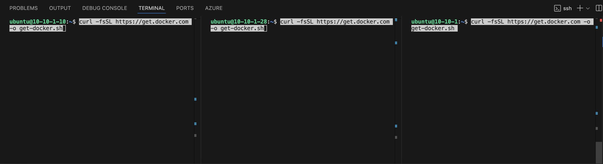
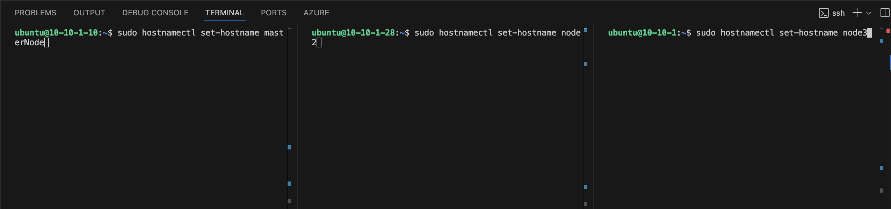
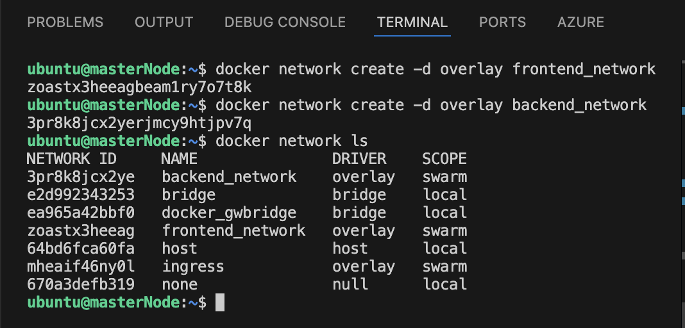

# FullStack-Multi-Node


Introduction: This article is hands on and focuses on docker swarm and the creation of services MySQL and Wordpress.

You will need a AWS account to follow along, and the rest of this article assumes you have this installed.

You will complete these following steps:

    Launching 3 Instances
    Configure .ssh file in VS Code
    ssh into each instance
    Install Docker
    Give the correct permissions to run docker commands
    set a host name on each instance
    Initialize swarm and join the other nodes as workers
    Create a frontend and a backend network
    Add MySQL and Wordpress services
    Verify and Inspect the services
    Check the running tasks for each service
    Confirm persistent storage and Inspect the volume details

This is a project that you have to be very meticulous about when configuring the nodes. Being familiar with the command line will save you a lot of hassle when it comes to troubleshooting problems.

Launching 3 Instances:

Go to the AWS console and go into EC2 and click launch Instances, In this interface you will need to configure the nodes. We are using a t2.micro Instance type and a keypair that you can setup yourself.


Ubuntu is the OS and the number of Instances are 3

Now for the network settings we are using a custom VPC that has 4 subnets, and we are enabling the Auto-assign public IP, and for the Firewall (security groups) we are selecting an existing security group with the following security group rules with PORTS 22 • 2377 • 2376 • 7946 • 4789 Open that is all that is needed, but I also have PORTS • 50000 • 5000 • 8080 • 80 Open for nginx and Jenkins in case I want to add on so its up to you how you want to proceed, but in the case of this project you only need the first set of Ports to be open.


Once you have configured the Instances and all the relevant sections then launch your instances.

Configure .ssh file in VS Code

Now in my workflow after I have the Instances launched I configure my .ssh config so its ready to go, like so. Give your Host a name and grab the Public or Private IP from each instance and place it in the HostName, your user will be ubuntu with a lowercase u, and the IdentityFile will be the location of the .pem key you downloaded or already had.


[Development using SSH](https://code.visualstudio.com/docs/remote/ssh)

You can find your Public and Private IP addresses here at the top Public at the left of the Private and as you can see I copied the IP in the image for context. Do this for each individual node.


ssh into each instance:

In each terminal you want to make sure you have the correct Instance IP so you can now ssh into the instances one by one, by 1st running the chmod 400 command so the key is not publicly viewable, like so

```bash
chmod 400 "pemkeyname.pem"
```


Then run the example ssh command to get in your nodes


Install Docker:

we will run the commands to install docker, first the top command then the bottom

```bash
curl -fsSL https://get.docker.com -o get-docker.sh

sh get-docker.sh
```




[Install Docker Engine on Ubuntu](https://docs.docker.com/engine/install/ubuntu/)

Give the correct permissions to run docker commands:

these will assure us that we don’t get hung up on running any of the docker commands

```bash
sudo chmod 666 /var/run/docker.sock
```


Set a host name on each instance:

Now for each node we will set a host name for them so we can have System Identification and have clarity.

```bash
sudo hostnamectl set-hostname masterNode

sudo hostnamectl set-hostname node2

sudo hostnamectl set-hostname node3
```



[Networking](https://docs.docker.com/engine/network/)

Initialize swarm and join the other nodes as workers

Here we will initialize our swarm and join the other nodes as workers

NOTE: we use the Private IP at the end of the swarm command, and once that command is ran and everything is setup properly it gives us the command with the token so we can add the other nodes to the swarm.

```bash
docker swarm init --advertise-addr 10.10.1.10


docker swarm join --token SWMTKN-1-5dsdgns87tjwfx16fm5d41i7d7ew2srdzwizbn5hpt5rc4eypa-9nj7gcmvqqkfpm2u4t4yu5u4m 10.10.1.197:2377
```


NOTE: here you can see that only the Master node can run the commands to retrieve information, the worker nodes give a response of this is not a swarm manager.

[Swarm Mode](https://docs.docker.com/engine/swarm/)


Create a frontend and a backend network:

Here we will start adding on our frontend and backend network

```bash
docker network create -d overlay frontend_network
docker network create -d overlay backend_network
```

Verify the network creation

```bash
docker network ls
```

[docker network create](https://docs.docker.com/reference/cli/docker/network/create/)

In this image you can see both networks being created and the verification of the networks



Add MySQL and Wordpress services:

Next we will begin adding the Database MySQL server and Wordpress services

MySQL


Wordpress


[Deploy a Service to Swarm](https://docs.docker.com/engine/swarm/swarm-tutorial/deploy-service/)

Verify and Inspect the services

Lets verify the services with these commands


Then we will inspect each individual service starting with MySQL service


Next the Wordpress service.


[Docker Service Inspect](https://docs.docker.com/reference/cli/docker/service/inspect/)

Check the running tasks for each service:

Now we will check the running task for both MySQL and Wordpress

MySQL


Wordpress


Confirm persistent storage and Inspect the volume details:

And last but not least we will check the persistence of the data volumes, in the image you will see its listed, and also stored in the correct location for data persistence with is /var/lib/docker/volumes


[Volumes](https://docs.docker.com/engine/storage/volumes/)

Conclusion:

The journey of building a fullstack web application with persistence utilizing a MySQL database and a scalable WordPress service demonstrates the power of the tools and practices used in DevOps environments. Although I integrated this with the cloud provider AWS, it can be used across multi-cloud environments and orchestrated with Kubernetes, this is the foundation of resilience, scalability, and high availability the cornerstone that remains crucial for any production-grade application.

This Fullstack Application on AWS uses Containerization with Docker. On this journey I have become very excited about this technology so the projects you will be seeing from me will mainly be with Kubernetes style configurations and Automation with Terraform. Any feedback feel free to reach me on my social sites linked below.
